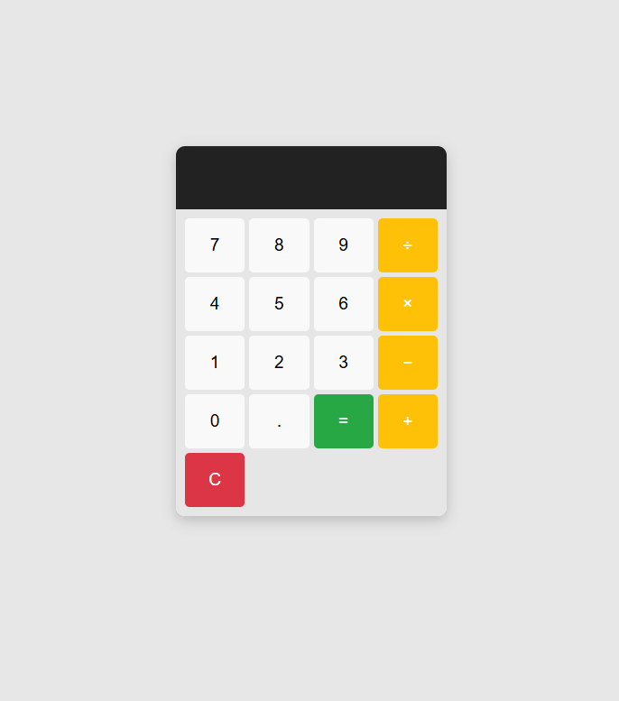

# Calculadora

Este projeto é uma calculadora simples e estilosa criada com HTML, CSS e JavaScript. A interface é minimalista e funcional, permitindo realizar operações matemáticas básicas.

## Funcionalidades

- **Operações suportadas**: Adição, Subtração, Multiplicação e Divisão.
- **Botão de limpar (C)**: Reseta a calculadora.
- **Botão de igual (=)**: Calcula o resultado da operação.
- Interface responsiva e visual atraente.

## Pré-requisitos

Para executar este projeto, você só precisa de um navegador moderno.

## Como usar

1. Clone este repositório (se aplicável) ou baixe os arquivos.
2. Abra o arquivo `index.html` no navegador.
3. Use os botões para realizar cálculos.

## Tecnologias Utilizadas

- **HTML**: Estrutura da calculadora.
- **CSS**: Estilização para um design limpo e moderno.
- **JavaScript**: Lógica das operações e interatividade.

## Visual do Projeto

## Como Contribuir

Se você deseja contribuir:

1. Faça um fork do repositório.
2. Crie uma nova branch: `git checkout -b minha-melhoria`.
3. Faça suas alterações e commit: `git commit -m 'Minha melhoria'`.
4. Envie para o repositório principal: `git push origin minha-melhoria`.
5. Abra um pull request.

---
